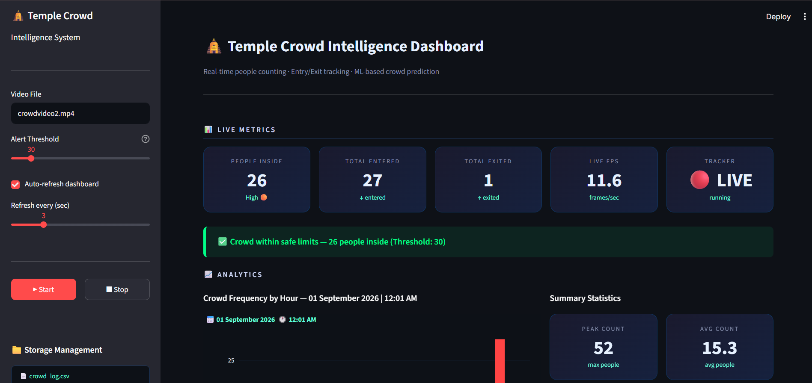
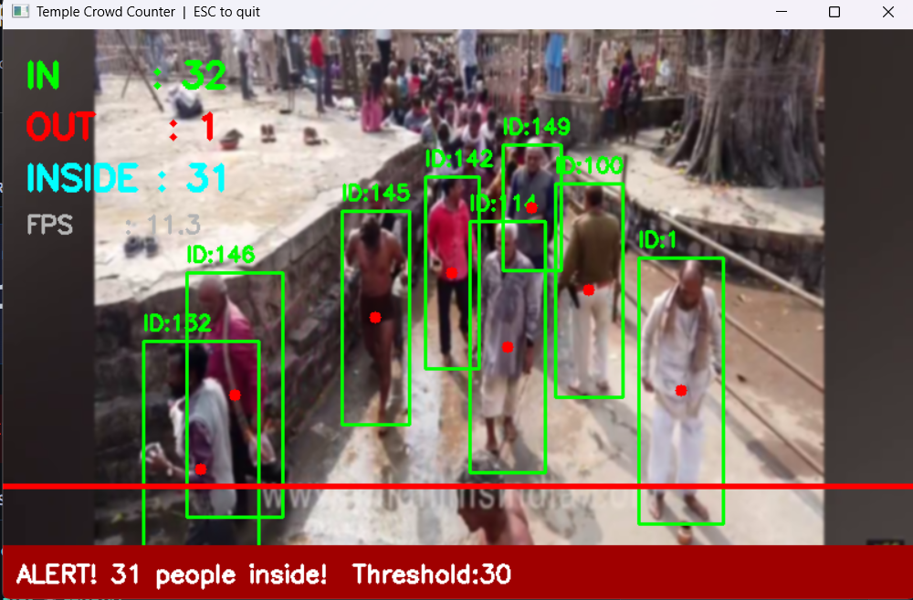
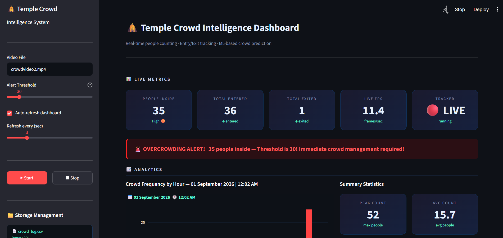
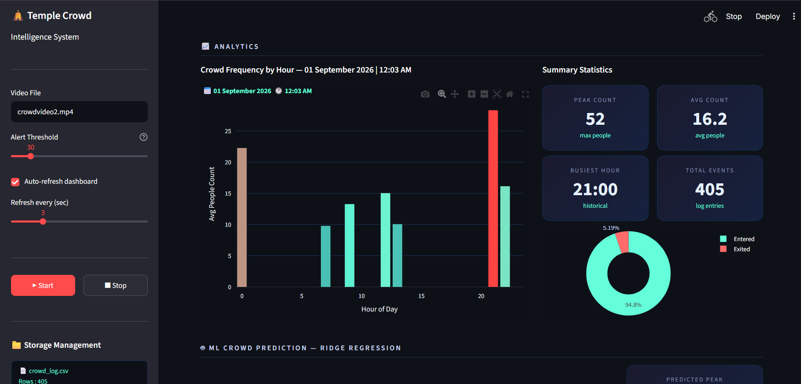
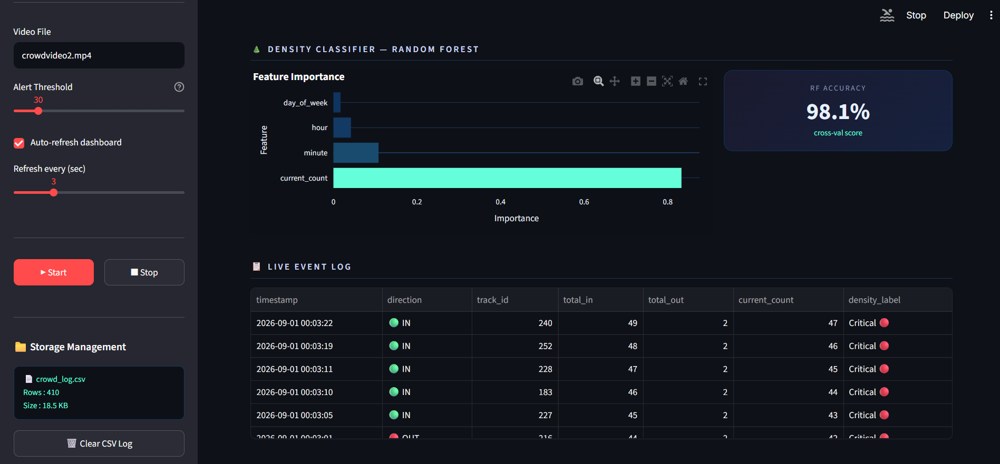

# Temple Crowd Monitoring Intelligent System

## Project Overview

Developed an intelligent **Temple Crowd Monitoring System** to automate crowd monitoring and replace manual counting with real-time person detection, entry/exit tracking, and occupancy estimation for improved safety and resource management.

## Key Features

- Real-time person detection and tracking
- Automated entry/exit monitoring
- Real-time occupancy estimation
- Persistent person tracking
- 6-hour crowd prediction
- Crowd density classification
- Threshold-based overcrowding alerts
- Crowd flow and historical analytics
- Prediction insights
- Live event logging
- Downloadable CSV reports

## Technology & Methodology

- **YOLOv8n** – Person detection, pretrained on the COCO dataset
- **ByteTrack** – Persistent multi-object tracking
- **Ridge Regression** – 6-hour crowd prediction
- **Random Forest** – Crowd density classification
- **3-Fold Cross Validation** – Model validation
- **Streamlit** – Interactive analytics dashboard
- **OpenCV** – Video processing
- **Pandas & NumPy** – Data processing
- **Plotly** – Data visualization

## System

The system integrates a computer vision and machine learning pipeline for real-time person detection, persistent tracking, entry/exit monitoring, occupancy estimation, crowd-density classification, and future crowd prediction.

## Analytics Dashboard

Designed and deployed a **Streamlit-based analytics dashboard** providing:

- Real-time crowd monitoring
- Crowd flow analytics
- Peak and average crowd statistics
- 6-hour crowd prediction insights
- Overcrowding alerts
- Density classification
- Random Forest feature-importance analysis
- Live event logs
- Downloadable CSV reports

## Project Screenshots

### Main Dashboard

### Real-Time Detection & Tracking

### Overcrowding Alert

### Crowd Analytics

### Density Classification & Event Logs

## Model Weights

The **YOLOv8n pretrained model weights (`yolov8n.pt`) are not included in this repository** due to file-size considerations. The required weights can be obtained through the standard YOLO/Ultralytics model download mechanism when running the project.

## Source Code

> **Note:** The complete source code and implementation are maintained in a **private repository** and can be shared with recruiters or reviewers upon request.
